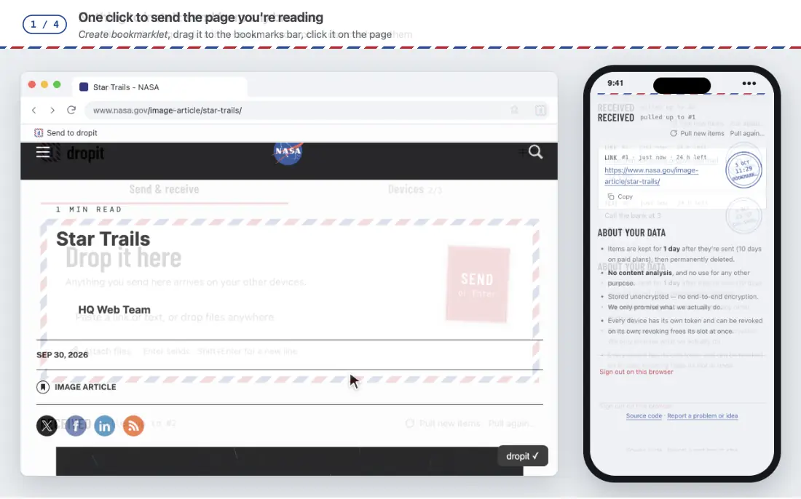

# dropit

[English](./README.md) · **简体中文**

**在一台设备上投出去，其他每台设备上都已经在等你。**

手机上的一个链接、浏览器里的一段话、终端里的一个文件：一下投进去，几秒后它就在 Obsidian 里、
电脑的某个文件夹里、任何一个浏览器里。不用翻聊天记录，不用选「发给谁」—— 只在你自己的设备之间。

投递后保留 1 天（付费版 10 天）：dropit 负责送到，不负责存着。

这个仓库是开源的各个客户端。Obsidian 插件在单独的仓库：
[smart-kits/dropit-obsidian](https://github.com/smart-kits/dropit-obsidian)。

## 你的每台设备上

| 在 | 用 | 最顺手的用法 | 说明 |
|---|---|---|---|
| **iPhone · iPad** | **dropit** 快捷指令 | 在任何 App 里「分享」→ **dropit** —— 照片、视频、文件、链接、文字。绑定到「轻点背面」后，敲两下手机背面就投剪贴板 | [shortcuts/](./shortcuts/README.zh-CN.md) |
| **Chrome · Edge** | 扩展 | 点图标按<kbd>回车</kbd>，投这个页面连同标题；<kbd>Alt</kbd>+<kbd>Shift</kbd>+<kbd>S</kbd> 投选中的文字；右键图片投文件本身；截图直接粘贴 | [extension/](./extension/README.zh-CN.md) |
| **Obsidian**（桌面、移动） | 插件 | 投来的一切都成为笔记 —— 有标题、图片嵌在里面、出处带链接；右键把笔记和文件发出去 | [dropit-obsidian](https://github.com/smart-kits/dropit-obsidian/blob/main/README.zh-CN.md) |
| **终端**（macOS、Linux） | `dropit` | `pbpaste \| dropit send`、`dropit send -f report.pdf`；`dropit watch` 让一个文件夹自己长出内容；还能接 Raycast、Alfred、服务菜单 | [cli/](./cli/README.zh-CN.md) |
| **任何浏览器** | 网页收件箱 [dropit.smart-kits.xyz](https://dropit.smart-kits.xyz) | 不用安装：打字、粘贴、把文件拖进来；查看和下载收到的东西；添加和移除设备 | [见下文](#网页收件箱) |

在任何设备上打开 [dropit.smart-kits.xyz](https://dropit.smart-kits.xyz)，它会推荐适合这台设备的客户端，
每个客户端的安装步骤都在「设备」页里。

## 用上它的一天

- **地铁上**，手机里看到一篇文章：「分享」→ **dropit**。到了工位，它已经是 Obsidian 里的一篇笔记，标题和简介都在。
- **工位上**，浏览器里一段话：选中，<kbd>Alt</kbd>+<kbd>Shift</kbd>+<kbd>S</kbd>。手机上收到这段话，还附着原网页的链接。
- **一张等会儿要在手机上用的截图**：<kbd>Alt</kbd>+<kbd>Shift</kbd>+<kbd>D</kbd>、<kbd>⌘</kbd><kbd>V</kbd>、<kbd>回车</kbd>。
- **借来的电脑**：打开网页收件箱，用配对码加入，把文件拖进去，退出 —— 这台设备立刻从你的账号里消失。
- **一个要跑很久的构建**：`make && dropit send "构建完成 ✅"`，手机会告诉你。

## 网页收件箱



<sub>画面内容：NASA 照片与页面（公共领域）· Lonely Planet 页面链接。</sub>

[dropit.smart-kits.xyz](https://dropit.smart-kits.xyz)，任何浏览器、手机电脑都行，什么都不用装。

**投**

- 在信封里打字或粘贴，按<kbd>回车</kbd>（或点红色邮票）。<kbd>Shift</kbd>+<kbd>回车</kbd> 换行。
- **把文件拖到页面任意位置**、粘贴截图，或者点「选文件」—— 一次最多 10 个，和文字一起作为一整份投出。
- 没投成的会盖上红色「**退回**」章并写明原因，留在信封上；你写的东西一个字都不会丢。

**收**

- 每次投递都是一封带邮戳的信：日期、时间、从哪儿来。链接显示标题和简介；选中的文字和图片显示「来自 页面 ↗」。
  每封信上有「复制」「下载」，还写着还能保留多久。
- 这个页面不实时监听：点「拉取新内容」取新的；「重新拉取…」可以拉回全部、最近 N 条或最近 N 天。

**设备**

- 「生成配对码」给出 6 位配对码和二维码（已经帮你复制好）。用手机相机扫，或者在另一台设备上输入；新设备加入后页面会自己发现。
- 账号里的每台设备、最近一次在线时间，点「吊销」立刻移除。
- 你的套餐和用了多少空间，以及免费版和付费版的对照。
- 「生成 bookmarklet」给你一个书签：在任何浏览器里点它，就投当前页面或选中的文字，什么都不用装。
  每个 bookmarklet 都是单独的一台只能投递的设备。

**要知道的：** 在浏览器里加入，它就成了你的一台设备 —— 在借来的电脑上，点「在这台浏览器上退出」，
立刻从你的账号里移除。界面有中英文（右上角切换），跟随你的浅色或深色设置。

## 三步开始

1. **第一台设备创建账号。** 网页收件箱：「临时用？在浏览器里直接用」→「创建新账号」。
   或者终端里 `dropit pair`；Obsidian 里「设置 → dropit → 创建新账号」。
2. **在这台设备上调出配对码：** 网页收件箱 →「设备」→「生成配对码」；终端 `dropit code`；
   Obsidian「设置 → dropit → 添加设备」。
3. **在其他每台设备上用配对码加入** —— 或者用手机相机扫它的二维码。
   在 iPhone 上扫码，会打开快捷指令的设置并填好配对码 —— 点「设置快捷指令」即可。

配对码 5 分钟有效、只能用一次，而且很宽容：大小写、空格、短横线，`0`/`O` 或 `1`/`I`/`l` 搞混都没关系。

用 AI 编程助手（Claude Code、Codex、Cursor……）？把这段贴给它：

```text
Install dropit on this machine for me by following
https://raw.githubusercontent.com/smart-kits/dropit-client/main/AGENTS.md
Ask me before creating an account, and never show or commit my token.
```

它会装好终端客户端并加入账号、确认能用，需要你动手的部分（加载浏览器扩展、添加 iPhone 快捷指令）会告诉你具体点哪里。
给 AI 的说明在 [AGENTS.md](./AGENTS.md)。

## 你可以放心的

- **什么都不用选。** 投递时从不问问题，投出去就到你所有的设备。
- **投没投到，一看就知道。** 每个客户端都会明确告诉你投到了，或者明确说为什么没投成 —— 断网绝不会显示成功。
- **不丢一条，也不重复。** 接收端只在内容安全写好之后才往前走：崩溃最多重复一条，绝不会漏一条。
  一分钟内紧挨着投两次同样的东西（手滑连点、重试），只存一份。
- **每台设备各管各的。** 每台单独加入、单独移除。只能投递的设备 —— iPhone 快捷指令、浏览器扩展、bookmarklet —— 读不到你投过的任何东西。
- **小而开放。** 终端客户端只是一个 Node.js 文件；扩展直接加载就能用；没有构建步骤，没有依赖。

## 安全与隐私

- 每台设备的钥匙只存在那台设备上 —— 终端：`~/.config/dropit/config.json`（只有你能读）；
  扩展：浏览器的扩展本地存储；Obsidian：插件的 `data.json`；网页收件箱：浏览器的本地存储。
- 钥匙分两种：**完整权限**（能投、能收、能添加设备）和**只能投递**。扩展和 iPhone 快捷指令加入时拿的是只能投递的，
  就算泄露也读不到你的内容。
- 设备丢了？在任何另一台设备上移除它：网页收件箱 →「设备」→「吊销」，或者 `dropit devices` 再 `dropit revoke <id>`。
- 在扩展里退出，会把它从账号里移除。同一台电脑上重新加入或重新配对（比如重装之后）会替换之前那次，不再多占名额。
  为了认出来，客户端会带上它原来的钥匙（如果还有），以及一个设备指纹：几项不常变的信息的 SHA-256 摘要
  （扩展：浏览器品牌、平台、CPU 核数、内存、时区、显卡；终端：主机名、用户、系统、CPU、内存、机器 ID 和配置文件路径）。
  离开设备的只有摘要，它也不是登录凭证。
- 服务上存了什么、存多久、谁能看到：[隐私说明](https://dropit.smart-kits.xyz/privacy)。

## 问题和建议

[提一个 issue](https://github.com/smart-kits/dropit-client/issues)。每个客户端里都有入口：扩展在弹窗底部，
网页收件箱在页面底部，终端在 `dropit` 的帮助文字里，Obsidian 在「设置 → dropit → 反馈」。
issue 是公开的 —— 千万别贴钥匙（`dk_…`）。

## 参与开发

- 第一次提交前打开密钥扫描，这样钥匙永远进不了仓库：

  ```bash
  brew install gitleaks          # 或见 https://github.com/gitleaks/gitleaks
  git config core.hooksPath .githooks
  ```

- 推送前跑测试（没有依赖）：`node test/i18n.test.mjs`、`node test/extension.test.mjs`、`node test/cli-render.test.mjs`、`node test/cli-logic.test.mjs`。
- 每条界面文案都在英文和中文两张表里；两边都要加，不然测试会失败。
- 提交信息用英文。文档成对：`README.md`（英文）和 `README.zh-CN.md`（简体中文）—— 两份都要改。

界面跟随你的语言：默认英文，系统、浏览器或 Obsidian 设为中文时显示简体中文。
终端读 `LANG`；用 `DROPIT_LANG=zh` 或 `DROPIT_LANG=en` 强制指定。

## 许可证

[MIT](./LICENSE)
