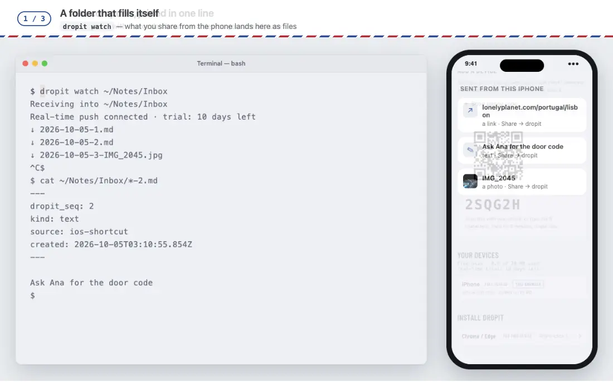

# dropit for 终端

[English](./README.md) · **简体中文**

**剪贴板、一个文件、脚本跑完的结果 —— 一行命令，就到手机和其他每台设备上。
再加一个会自己长出内容的文件夹：别处投来的东西，都落在这里。**

支持 macOS 和 Linux。单个 Node.js 文件，没有依赖。



<sub>画面内容：Lonely Planet 页面链接 · NASA 照片（公共领域）。</sub>

## 一行就够

| 你想… | 运行 | 你会看到 |
|---|---|---|
| 把刚复制的东西发到手机 | `pbpaste \| dropit send` | `✓ #41` |
| 把一个文件发到手机 | `dropit send -f ~/Desktop/report.pdf` | `✓ #42 report.pdf 820 KB` |
| 给自己记一句 | `dropit send "下午三点给银行打电话"` | `✓ #43` |
| 长任务跑完时知道一声 | `make release && dropit send "发版打包好了 ✅"` | 跑完那一刻，这句话就到了 |
| 把命令输出放到能看的地方 | `git log -5 --oneline \| dropit send` | 这五行，作为一条 |
| 别处投的东西都变成这里的文件 | `dropit watch ~/dropit` | `↓ 2026-10-04-44.md`、`↓ 2026-10-04-45-IMG_2041.jpeg` …… |

几个词会合成一条：`dropit send 六点 见` 投出去的是「六点 见」。
整条只是一个 `http(s)://` 地址时按链接投，其他按文字投。

## 投递

```bash
dropit send "一段文字"            # 文字，或者一个链接
some-command | dropit send        # 管道里流过来的内容，作为一条
dropit send < notes.txt           # 一个文本文件的内容
dropit send -f photo.jpg          # 一个文件：图片、视频、PDF，什么都行
```

- **一次投好几个文件：** `dropit send -f *.png` —— 最多 10 个，作为一批投出、一起到。
  超过 10 个就一个都不发；有文件找不到，也会在发之前就报出来。
- **大文件边读边传**，不会先整个读进内存。单个文件多大由你的套餐决定。
- **手滑投了两次？** 一分钟内紧挨着投两次同样的东西，只存一份，提示 `已投过了（#41）`。
- **写脚本可以放心依赖它：** 成功退出码是 `0`；任何失败都把原因打到 stderr，退出码 `1`。

## 会自己长出内容的文件夹

```bash
dropit watch ~/dropit            # 文件夹会被记住：下次直接 `dropit watch`
```

它先把没开着的这段时间里到的内容全部补齐，然后保持连接，新内容一到就写下来：

| 别处投来的 | 落在这里是 |
|---|---|
| 文字、链接 | `2026-10-04-44.md` |
| 文件 | `2026-10-04-45-IMG_2041.jpeg`，原样保存 |

笔记长这样 —— 浏览器扩展投来的网页保留标题和简介，选中的文字保留出处：

```markdown
---
dropit_seq: 44
kind: url
source: chrome-extension
created: 2026-10-04T07:30:00.000Z
---

[How Airmail Worked](https://example.com/airmail)

> A short history of the red-and-blue envelope.
```

把它指向 Obsidian 或 Logseq 的某个文件夹，每一条就都成了那里的一篇笔记。

- **不漏一条，也不重复。** 文件安全写好之后，进度才往前走；文件夹里已经有的文件从不覆盖。
- **文件没下载下来**，原位置会留一篇说明，写清原因和重新拉取的命令：`dropit watch --from 45`。
- **重新拉取：** `dropit watch --days 3`（最近三天）或 `--from 40`（从第 40 条起）。
  新加入的设备只收加入之后投的内容；想要以前的，就这样拉回来 —— 能拉回多久，取决于你的套餐保留多久。
- 这台机器自己投的也会收下来，所以这个文件夹是一份完整的记录。
- 文件名里的日期是 UTC 日期。

### 实时，以及不实时的时候

`watch` 的实时连接需要 Node.js 22 以上（更早的版本补齐一次就停）。

| 它说 | 意思是 |
|---|---|
| `实时推送已连接` | 实时 —— 几秒内就到 |
| `实时推送已连接 · 体验还剩 3 天` | 新账号有一段实时推送体验期 |
| `……10 天的实时推送体验已结束……` | 补齐后退出；再运行一次（或者定时运行）就会补齐 |
| `……今天的实时名额满了……` | 原地等着，UTC 零点过后自己重连 |

### 让它一直开着

**macOS** —— 一个登录时启动 `watch` 的启动项。存为 `~/Library/LaunchAgents/xyz.smart-kits.dropit.plist`，
把里面三个路径换成你自己的（`command -v dropit`、`dirname "$(command -v node)"`、你的用户目录）：

```xml
<?xml version="1.0" encoding="UTF-8"?>
<!DOCTYPE plist PUBLIC "-//Apple//DTD PLIST 1.0//EN" "http://www.apple.com/DTDs/PropertyList-1.0.dtd">
<plist version="1.0">
<dict>
  <key>Label</key><string>xyz.smart-kits.dropit</string>
  <key>ProgramArguments</key>
  <array><string>/Users/you/.local/bin/dropit</string><string>watch</string></array>
  <key>EnvironmentVariables</key>
  <dict><key>PATH</key><string>/opt/homebrew/bin:/usr/local/bin:/usr/bin:/bin</string></dict>
  <key>RunAtLoad</key><true/>
  <!-- 崩了就重启；正常退出（比如实时体验期结束）不重启 -->
  <key>KeepAlive</key><dict><key>SuccessfulExit</key><false/></dict>
  <key>StandardOutPath</key><string>/Users/you/Library/Logs/dropit.log</string>
  <key>StandardErrorPath</key><string>/Users/you/Library/Logs/dropit.log</string>
</dict>
</plist>
```

```bash
launchctl load ~/Library/LaunchAgents/xyz.smart-kits.dropit.plist      # 现在启动，以后每次登录都启动
launchctl unload ~/Library/LaunchAgents/xyz.smart-kits.dropit.plist    # 停掉
```

**Linux** —— 一个用户服务，`~/.config/systemd/user/dropit.service`：

```ini
[Unit]
Description=dropit watch

[Service]
ExecStart=%h/.local/bin/dropit watch
Restart=on-failure

[Install]
WantedBy=default.target
```

`systemctl --user enable --now dropit`。找不到 `node` 的话，加一行 `Environment=PATH=…`，写上 `node` 所在的目录。

## 在 Mac 上随手就投

终端是引擎，下面这几样把它放到一个按键的距离。

| | 得到什么 | 怎么设置 |
|---|---|---|
| **Raycast** | 「Send to dropit」投剪贴板里的文字；「Send File to dropit」按路径投一个文件。结果（`✓ #46`）直接显示在 Raycast 里 | Raycast → *Extensions → Script Commands → Add Directory* → 选 `cli/raycast/` |
| **在任何 App 里右键选中的文字** | 「服务 → Send to dropit」 | 见下文 |
| **Alfred** | 一个投剪贴板的快捷键 | 见下文 |

**服务菜单**（用「自动操作」）：

1. 打开「自动操作」→ *新建文稿* → **快速操作**。*工作流程收到当前* **文本**，位于 **任何应用程序**。
2. 加一个 **运行 Shell 脚本**，*传递输入*选 **作为自变量**，粘贴下面两行（路径以 `command -v dropit` 的结果为准）：

   ```bash
   export PATH="/opt/homebrew/bin:/usr/local/bin:$PATH"
   "$HOME/.local/bin/dropit" send "$1"
   ```

3. 存为「Send to dropit」。在任何地方选中文字 → 右键 → *服务* → *Send to dropit*。
   在 *系统设置 → 键盘 → 键盘快捷键 → 服务* 里还能给它配一个快捷键。

这样投出去没有任何提示。想看到结果 —— ✓ 或者失败原因 —— 把第二行换成：

   ```bash
   "$HOME/.local/bin/dropit" send "$1" 2>&1 | xargs -0 osascript -e 'on run a' -e 'display notification (item 1 of a) with title "dropit"' -e 'end run'
   ```

**Alfred：** 建一个 Workflow，**Hotkey** 触发器连到 **Run Script**（`/bin/bash`）：
`export PATH="/opt/homebrew/bin:/usr/local/bin:$PATH"; pbpaste | "$HOME/.local/bin/dropit" send`。

在 Linux 上，把 `pbpaste` 换成 `wl-paste` 或 `xclip -o -selection clipboard` 来读剪贴板。

## 一分钟装好

```bash
curl -fsSL https://dropit.smart-kits.xyz/install.sh | sh    # 装进 ~/.local/bin，不用 sudo；需要 Node.js 18+
```

再运行一次就是更新。习惯用 git？`git clone https://github.com/smart-kits/dropit-client.git`，
把 `cli/dropit` 链接到 `PATH` 里的某个目录。

然后加入你的账号：

```bash
dropit pair K7M2QX     # 用一台已经在用的设备上的配对码（网页收件箱的「设备」页；Obsidian 的「设置 → dropit」）
dropit pair            # 只在你的第一台设备上用：创建账号
dropit me              # free · 2/3 台设备 · 1.2/30 MB · 单个文件最大 5 MB · 实时推送体验期：还剩 3 天
```

> 已经加入过的机器上直接运行 `dropit pair`，会停下来说明，不会把你切到一个空的新账号。
> 要加入另一个账号，带上它的配对码；确实要在这里另建一个账号，用 `dropit pair --new`。

## 在这里管理账号

| 命令 | 作用 |
|---|---|
| `dropit code` | 给新设备生成 6 位配对码，5 分钟内有效 —— 在那台设备上输入，或在另一个终端里 `dropit pair <配对码>` |
| `dropit me` | 套餐、用了几台设备、用了多少空间、单个文件最大多少、实时推送开没开 |
| `dropit devices` | 账号里的每一台设备，带它的 ID |
| `dropit revoke <device_id>` | 立刻移除一台设备并释放名额 —— 丢了的笔记本、换下来的旧手机 |

配对码很宽容：大小写、空格、短横线，`0`/`O` 或 `1`/`I`/`l` 搞混都没关系。

## 出问题时

| 它说 | 意思是 | 怎么办 |
|---|---|---|
| `还没配对` | 这台机器还没加入 | `dropit pair <配对码>` |
| `token 无效` · `设备已被移除` | 这台机器被从账号里移除了 | 拿一个新配对码，`dropit pair <配对码>` |
| `配对码无效` · `配对码已过期` | 输错了、用过了，或者超过了 5 分钟 | 重新生成一个 |
| `设备数已达上限` | 套餐的设备名额用完了 | `dropit devices`，再 `dropit revoke <id>` 一台不用的 |
| `超过了单条上限 5 MB` | 文件超过了套餐的单个文件上限 | 投小一点的文件，或者投它的链接 |
| `网络不可用（试过 N 个地址）` | 没网，或者代理拦住了 | 检查网络或代理 |
| `Node.js < 22，没有全局 WebSocket` | 实时推送需要 Node.js 22+ | 升级 Node.js，或者定时运行 `watch` |

## 其他

- 设置存在 `~/.config/dropit/config.json`（只有你能读）：这台机器的钥匙、在队列里的进度、`watch` 的文件夹。
  千万别分享或提交它。
- 终端加入后是一台完整权限的设备：能投、能收、能添加设备。
- 输出默认英文，`LANG` 是中文时显示简体中文；用 `DROPIT_LANG=en` 或 `DROPIT_LANG=zh` 强制指定。
- 问题和建议：[提一个 issue](https://github.com/smart-kits/dropit-client/issues)（是公开的 —— 别贴 token，`dk_…`）。

## 许可证

[MIT](../LICENSE)
