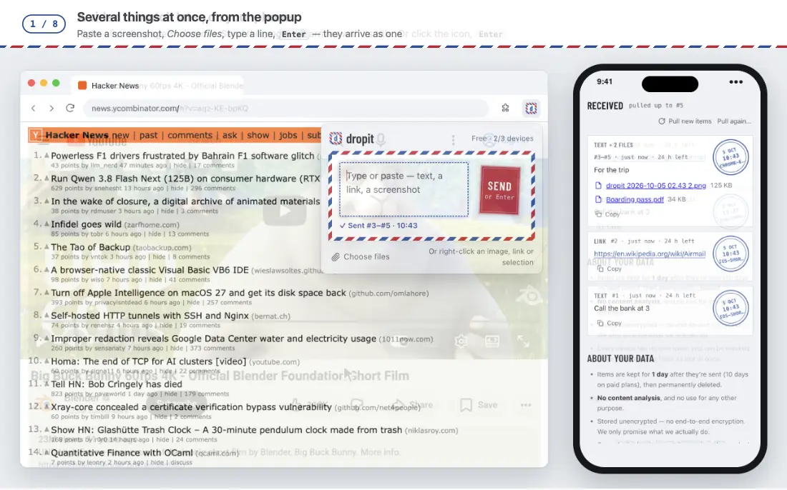

# dropit for Chrome

[English](./README.md) · **简体中文**

**浏览器里正在看的东西，一下就到你的其他设备上。**
一个页面、一段话、一张图、一份 PDF、一张截图：几秒后它就在 Obsidian 里、手机上、任何一个浏览器里等你。
支持 Chrome 和 Edge。



<sub>画面内容：YouTube 上的 <i>Big Buck Bunny</i> © Blender Foundation（CC BY 3.0）· Wikipedia（CC BY-SA 4.0）· Hacker News · NASA 图片与视频（公共领域）· arXiv:1706.03762《Attention Is All You Need》· Internet Archive《傲慢与偏见》（公共领域）。</sub>

## 一下就到

| 你正在看… | 这样做 | 其他设备收到 |
|---|---|---|
| 一篇想在手机上接着看的文章 | 点 dropit 图标，按<kbd>回车</kbd> | 链接**连同标题和简介**，不是光秃秃一串网址 |
| 一段值得留下的话 | 选中，按 <kbd>Alt</kbd>+<kbd>Shift</kbd>+<kbd>S</kbd> | 这段文字，换行原样保留，末尾附上出处链接 |
| 一张图 | 在图上右键 → **dropit** →「投这张图片」 | 图片文件本身 —— 离线能打开，网站删了也还在 |
| 刚截的屏 | <kbd>⌃</kbd><kbd>⇧</kbd><kbd>⌘</kbd><kbd>4</kbd>，再 <kbd>Alt</kbd>+<kbd>Shift</kbd>+<kbd>D</kbd>、<kbd>⌘</kbd><kbd>V</kbd>、<kbd>回车</kbd> | 这张截图，图片文件 |
| 在 Chrome 里打开的 PDF | 点图标，按<kbd>回车</kbd> | PDF 文件本身，不是链接 |
| 页面里直接播放的视频文件 | 在视频上右键 → **dropit** →「投这个视频」 | 视频文件（[流媒体网站不行](#做不到的)） |
| 自己的一句话 | 点图标，打字，<kbd>回车</kbd> | 这句话 |

一路上什么都不用选：不选文件夹、不打标签、不选「发给谁」。投出去，你加入过的每台设备都会收到。

## 弹窗

点 dropit 图标，或按 <kbd>Alt</kbd>+<kbd>Shift</kbd>+<kbd>D</kbd>。打开就是输入框，直接打字。

- **框下面那行字总会告诉你，回车会投什么** ——「回车投这个页面：……」「回车投这段文字」「回车投 2 个文件和这段文字」。不用猜。
- **框是空的** → 投这个页面，带上标题和作者写的简介。在 PDF 上就是 PDF 文件本身。
- **页面上选中了文字？** 打开时已经填好，投出去会注明来自哪个页面。想先改改也行。
- **什么都能粘贴**：文字、链接（按链接投）、截图、在访达里复制的文件（<kbd>⌘</kbd><kbd>V</kbd>）。也可以点「选文件」。
- **一次投好几样** —— 一段文字加最多 10 个文件 —— 对方收到的是一整份。
- <kbd>Shift</kbd>+<kbd>回车</kbd> 换行。用输入法选词时按的回车不会投出去。

投递时邮票保持按下，信封一圈红蓝条纹滚动起来，一批会数着走（「正在投递 2/3…」）。
投完**弹窗不关**：框下显示「✓ 已投递 #71 · 14:07」，输入框清空，接着投下一样。

## 右键

在页面上任何地方右键，都有一个 **dropit**。展开后是这里能投的东西，最具体的在前，「投这个页面」永远在最后一行：

| 在哪里右键 | **dropit** 展开后 |
|---|---|
| 选中的文字 | 投选中的文字 · 投这个页面 |
| 图片 | 投这张图片 · 投图片链接 · 投这个页面 |
| 带链接的图片 | 投这张图片 · 投图片链接 · 投这个链接 · 投这个页面 |
| 链接 | 投这个链接 · 投这个页面 |
| 指向文件的链接（PDF、ZIP、图片、视频、Office……） | 多一项「投链接指向的文件」 |
| 页面直接播放的视频或音频文件 | 投这个视频 / 投这段音频 · 投这个页面 |
| 其他任何地方 | 投这个页面 |

在工具栏的 dropit 图标上右键，有「把这个页面投进 dropit」。

## 两个快捷键

| 按键 | 效果 |
|---|---|
| <kbd>Alt</kbd>+<kbd>Shift</kbd>+<kbd>S</kbd> | **立刻投**，什么窗口都不弹：有选中就投选中的，没有就投这个页面（PDF 上投文件） |
| <kbd>Alt</kbd>+<kbd>Shift</kbd>+<kbd>D</kbd> | 打开弹窗，选中的文字已经在框里 |

Mac 上 <kbd>Alt</kbd> 就是 <kbd>⌥</kbd>。在 `chrome://extensions/shortcuts`（Edge：`edge://extensions/shortcuts`）里可以改。
从旧版本升级上来时，Chrome 有时没把快捷键设上 —— 去那里设一次就好。

## 投没投到，一眼就知道

- **右键或快捷键投完** —— 页面顶部弹一条小提示：「dropit · 已投递 #71」。
  没投成就是红框「dropit · 退回：……」，写明原因，停 5 秒。
- **在弹窗里** —— 框下显示「✓ 已投递 #71」；没投成是红色「退回」标记加原因，你写的内容原样留着。
- **图标上** —— 短暂亮蓝色 ✓ 或红色 ✗；这个浏览器还没加入账号时，一直亮着红色 **!**。
- **断网绝不会显示成功。** 路上连接被断（代理不稳、Wi-Fi 时好时坏），会先再试两次，才算失败。
- **手滑点了两下？** 一分钟内紧挨着投两次同样的东西，只存一份，照样提示已投递。
- **文件太大？** 超过你套餐单条上限的文件，在**下载之前**就告诉你，不用白等。

## 到了那边是什么样

| 在哪儿收 | 投的页面 | 选中的文字 | 图片或文件 |
|---|---|---|---|
| [Obsidian](https://github.com/smart-kits/dropit-obsidian) | `[标题](链接)`，简介作为引用 | 这段文字，后面一行 `— [页面标题](链接)` | 存进附件文件夹，嵌在笔记里 |
| 网页收件箱 | 一张卡片：标题、网址、简介 | 这段文字，后面一行「来自 页面标题 ↗」 | 下载链接 |
| [终端](../cli/README.zh-CN.md)（`dropit watch`） | 一篇带标题和简介的 Markdown 笔记 | 文字加出处一行 | 文件原样保存 |

## 一分钟装好

1. **拿到它。** 还没上架 Chrome 应用商店：在 [dropit.smart-kits.xyz](https://dropit.smart-kits.xyz) 下载后解压，
   或者 `git clone https://github.com/smart-kits/dropit-client.git`，用里面的 `extension/` 文件夹。
2. **装上它。** 打开 `chrome://extensions`（Edge：`edge://extensions`），打开**开发者模式**，
   点**加载已解压的扩展程序**，选这个文件夹。想看到 ✓ 的话，把 dropit 图标固定到工具栏。
3. **加入你的账号。** 点图标。在一台已经在用的设备上调出配对码 —— 网页收件箱的「设备」页、
   Obsidian 的「设置 → dropit」、或者终端里 `dropit code`。
   输入这 6 位，点「加入」；大小写、空格、`0` 和 `O` 搞混都没关系。
   这是你的第一台设备？点表单下面的小字「创建新账号」。

**更新：** 把新版本解压到同一个文件夹覆盖，再在 `chrome://extensions` 点「重新加载」。
文件夹不变，扩展就还是同一个 —— 不用重新加入。

## 它能读什么、什么时候读

| 权限 | 用来做什么 |
|---|---|
| `activeTab` + `scripting` | 只针对你正在操作的标签页、只在你操作的那一刻：读它的标题、简介和选中的文字，取你右键的那张图或那个文件 |
| `contextMenus` | 右键菜单里的 **dropit** |
| `storage` | 这个浏览器的登录信息，只存在这台电脑上 |
| `notifications` | 页面上显示不了提示时（`chrome://` 页面、应用商店）告诉你投递结果 |
| `declarativeNetRequestWithHostAccess` | 只对你允许过的网站（见下文）：扩展不得不自己去取文件时，说明你当时在哪个页面，和页面自己取时一样 —— 有些图床只认这个 |
| 可选：一次一个网站 | 只在某个网站不让页面交出文件时，弹一个只有一个按钮的小窗口问你 |

**安装时什么权限都不要** —— 你不操作，扩展读不了任何网站。
图片和文件**由页面自己去取**，和它平时加载的方式一样，所以绝大多数网站什么都不用多给。
极少数不肯的网站，才就这一个网站问你一次；随时可以在扩展的详情页里收回。

**账号是安全的。** 每个浏览器都是独立的一台设备，用配对码加入时拿到的是**只能投递**的钥匙：
就算泄露了，也没人能用它读你的内容、加设备或改设置。这把钥匙从不进入网页 —— 页面只负责交出文件内容。
要断开这个浏览器，点弹窗底部的「在这个浏览器上退出」，或者在别的设备上把它移除。

## 做不到的

- **流媒体视频**（YouTube、B 站和大多数视频网站）是几百个小片段边下边播，没有一个完整的文件，所以只有「投这个页面」。
  真想要文件，先用视频下载工具下好，再把文件投进来。
- **个别图床只给自家页面用。** 连说明来自哪个页面都不管用时，红框会直说，并建议改用「投图片链接」。
- **从桌面把文件拖到弹窗上**不行 —— 一点别处弹窗就关了。在访达里复制，再粘贴进弹窗，或者用「选文件」。
- **只能投，不能收。** 要在电脑上收，用 [Obsidian](https://github.com/smart-kits/dropit-obsidian)、
  [终端](../cli/README.zh-CN.md) 或网页收件箱。
- 桌面版 Chrome 没有系统分享面板：右键的 dropit、工具栏图标和两个快捷键，就是它的「分享」按钮。

## 开发者

```
extension/
├── manifest.json     Manifest V3
├── background.js     右键菜单、快捷键、投递、页面上的提示、角标与通知
├── popup.html/.js    弹窗：加入、投递输入框、进度
├── popup.css         航空信封样式（与授权小窗口共用）
├── payload.js        纯逻辑：回车投什么、元信息与大小、菜单、成批、错误文案
├── page.js           在页面里运行：标题和简介、选中的文字、取文件、页面提示
├── api.js            请求、重试、退回内置地址
├── grant.html/.js    就一个网站申请权限的小窗口
├── i18n.js           界面文案（英文 / 简体中文）
└── fonts/            标签字体（SIL 开放字体许可证，许可文件同目录）
```

没有构建步骤 —— 改完在 `chrome://extensions` 点「重新加载」。测试（在仓库根目录）：
`node test/extension.test.mjs` 和 `node test/i18n.test.mjs`。
界面跟随浏览器语言：默认英文，浏览器设为中文时显示简体中文。

## 许可证

[MIT](../LICENSE) · 字体：[Barlow Condensed](./fonts/OFL-barlow-condensed.txt) 和 [得意黑](./fonts/OFL-smiley-sans.txt) 的子集，SIL 开放字体许可证
