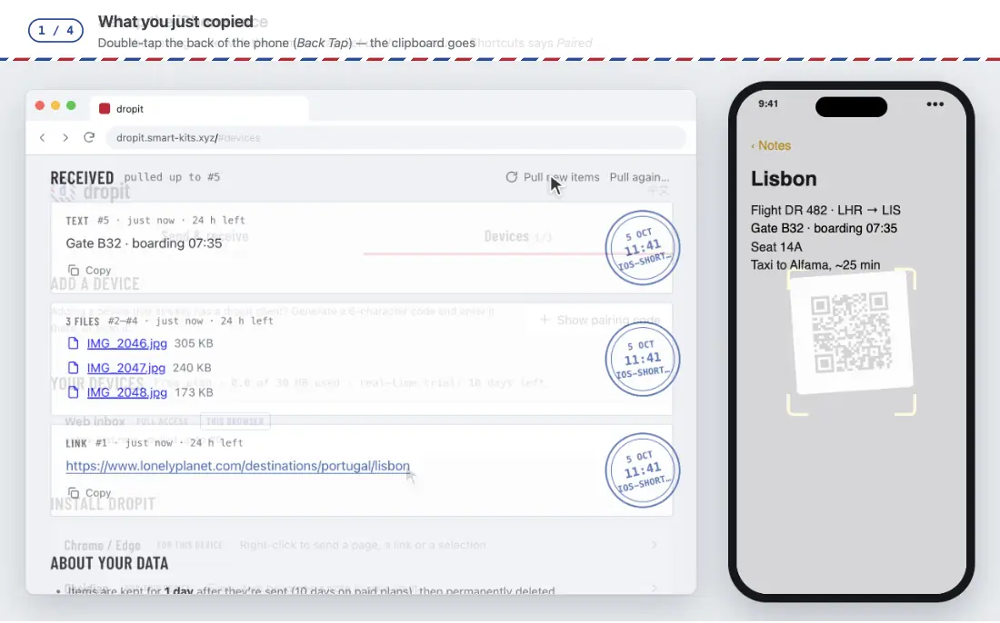

# dropit for iOS (Shortcuts)

**English** · [简体中文](./README.zh-CN.md)

The main way to send from iPhone and iPad: the **share sheet** and **Back Tap**.
Share photos, videos, files, a link or some text; a notification says what went — "3 photo/video sent".

The iPhone screens are drawn; what they send and what arrives is real. Shown: Lonely Planet · a NASA photograph (public domain).

## Install (one tap)

1. On the iPhone or iPad, open **https://dropit.smart-kits.xyz** in Safari and tap **Install the shortcut**, then **Add Shortcut**.
2. Pair it: on a device that already uses dropit, show a pairing code with its QR code
   (web inbox → *Add a device → Show pairing code*). Scan it with the iPhone camera,
   then tap **Set up the shortcut**. Shortcuts opens and says *Paired*.

That's it — share anything to **dropit**, or bind it to Back Tap (below).
The shortcut gets its own **send-only** device (`ingest_only`): if its token ever leaked, it
could not read your items, pair devices or change settings. The browser used for pairing stays signed out.

The installed file is built by [`build.py`](./build.py) (`python3 shortcuts/build.py` on a Mac signs it).

- **Photos, videos, files, PDFs** are uploaded one by one, as they are. Several shared at once arrive as one delivery.
- **Text, links, notes** are sent as text. A PDF open in a web page goes as its link; to send the PDF itself, save it to Files first and share it from there.
- **No input** (Home Screen, Back Tap) sends the clipboard. Coming from the share sheet, it never falls back to the clipboard.
- The same thing sent twice in a row within a minute counts once (a double tap); sent again later, or with something in between, it arrives again.
- If it's already paired, pairing again asks before replacing.
- It speaks English, or Chinese when the phone is set to Chinese.

---

## Build it yourself

If you'd rather build the shortcuts by hand, here are the steps. You can build them on a Mac:
the Shortcuts app syncs them to your iPhone through iCloud.

## 1 · dropit pair (run once)

| # | Action | Settings |
|---|---|---|
| 1 | Ask for Input | Text, prompt `Pairing code` |
| 2 | Get Contents of URL | `{API}/v1/pair/claim` · POST · JSON `{"code": Provided Input, "device_name":"iPhone", "scope":"ingest_only"}` |
| 3 | Get Dictionary Value | Key `token`, from the previous result |
| 4 | Save File | To `iCloud Drive/Shortcuts/dropit-token.txt`, **overwrite if the file exists** |
| 5 | Show Notification | `dropit: paired` |

- Get the pairing code from another device — `dropit code` in the CLI, or *Settings → dropit → Pairing code* in Obsidian. It's 6 characters, valid for 5 minutes, and forgiving about case, spaces, dashes and `0`/`O`, `1`/`I`/`l`.
- Instead of *Ask for Input* (step 1) you can use **Scan QR Code** on the pairing QR code; pass the scanned text to `code` as-is.
- Joining with a code gives the phone a **send-only** (`ingest_only`) token on purpose: if it ever leaked, it could not read your items, pair new devices or change settings.
- It only **joins** an account. The shortcut can't receive items or issue pairing codes, so an account created from it would have no way to read anything or add another device. Create the account on another client first — only have an iPhone? Use the web inbox in Safari, then set up the shortcut from its *Add a device*.

---

## 2 · dropit (send)

Create a new shortcut. In *Details*, turn on **Show in Share Sheet** and accept only **URLs** and **Text**.

| # | Action | Settings |
|---|---|---|
| 1 | Get File | `iCloud Drive/Shortcuts/dropit-token.txt` — **turn off** *Error If Not Found* |
| 2 | If | *File* **does not have any value** → Show Notification `Run “dropit pair” first` → Stop |
| 3 | Dictionary | Three keys, see below |
| 4 | Get Contents of URL | `{API}/v1/ingest` · POST · JSON (the dictionary from step 3) Header `Authorization` = `Bearer ` + the file from step 1 |
| 5 | Get Dictionary Value | Key `seq`, from *Contents of URL* |
| 6 | If | *Dictionary Value* **has any value** → Vibrate; **Otherwise** → Show Notification `dropit: send failed` |

The dictionary in step 3:

| Key | Value |
|---|---|
| `kind` | `url` or `text` |
| `raw` | Shortcut Input |
| `source` | `ios-shortcut` |

No hashing and no timestamps are needed — duplicate detection and the time are handled for you.

Check `seq`, not just "has any value": an error also comes back as a response (`{"error": …}`), so
checking for any value would vibrate on failures too. Success — and a same-day duplicate — carries `seq`.

### Back Tap

*Settings → Accessibility → Touch → Back Tap → Double Tap →* `dropit`.

For apps that don't offer a share sheet, make a copy that reads the **Clipboard** instead
(replace `raw` in step 3 with *Clipboard*): copy, then double-tap the back of your phone.

---

## What you'll see

| What happens | Meaning | What to do |
|---|---|---|
| A vibration and `… sent` | Sent: how many, and what (photos/videos, files, PDFs, text, a link) | — |
| `Already sent a moment ago` | The same thing twice in a row within a minute; it wasn't sent again | Wait a minute to send it again |
| `Couldn't send: …` / `Some didn't go: …` | Refused; the reason follows (too large for your plan, storage full, pair again…) | Do what it says; to pair again, repeat step 2 of Install |
| `Couldn't reach dropit, or the file is over 100 MB` | No answer from the service: no network, or the file is too large | Check the connection; a single file can be up to 100 MB |
| Shortcuts shows an error | No network | Check your connection |
| Notification `Not paired yet` | Not paired yet, or iCloud removed the token file | Pair again (step 2 of Install) |

## Limitations

- A single file can be up to 100 MB (5 MB on the free plan). Long videos pass that easily.
- PDFs and JSON files don't come with their names, so they're named after when they were sent (`dropit 09-30 15.08.pdf`). Photos and other files keep theirs.
- Verified on devices: pairing and sending text on iOS 26.6.1; sharing photos (one and several), a video, a PDF, Excel and JSON on iOS 27. The build-it-yourself steps above cover text and links only, and haven't been walked through on a device.
- Something wrong, or an idea? [Open an issue](https://github.com/smart-kits/dropit-client/issues/new?title=%5BiOS%20Shortcut%5D%20). Issues are public: never paste a token.

## License

[MIT](../LICENSE)
